# Tarkov Essential

Tarkov Essential은 Escape from Tarkov 플레이를 도와주는 애플리케이션입니다.

실시간 지도와 유용한 음성 알림을 제공하며, Tarkov Tracker에 퀘스트 진행 상황을 자동으로 업데이트하는 등 여러 편의 기능을 한곳에서 사용할 수 있습니다.

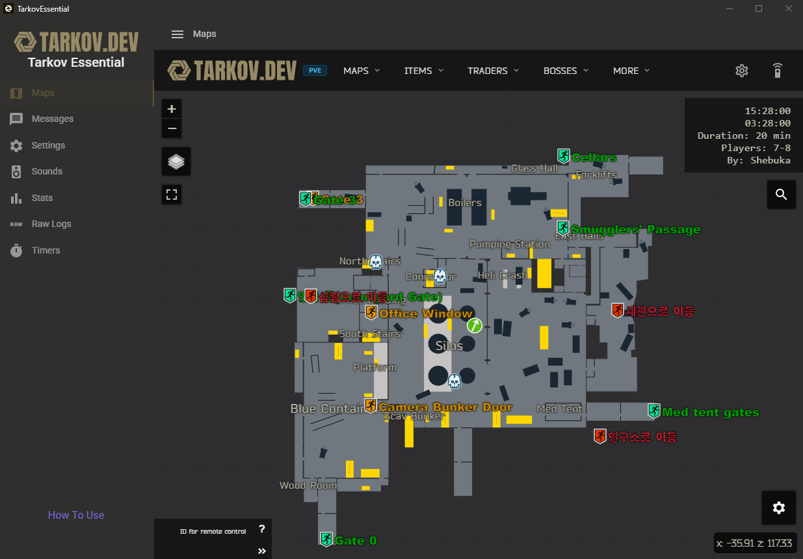
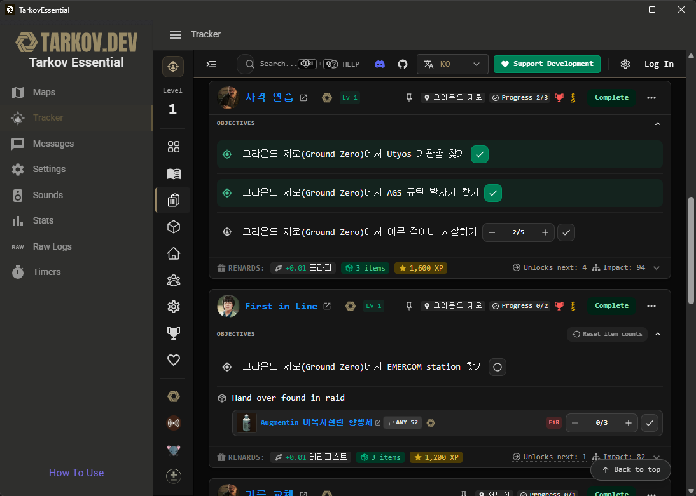

> [!WARNING]
> 본 프로그램은 [GPL-3.0 라이선스](./LICENSE)로 배포되며, **본 프로그램 사용으로 인한 어떠한 피해(BSG에 의한 제재 등)에 대해서도 책임지지 않습니다.**
> 본 프로그램은 [tarkov.dev](https://tarkov.dev/)과 공식적인 관계가 없으며, [TarkovMonitor](https://github.com/the-hideout/TarkovMonitor)를 수정하여 제작되었습니다.

## 설치 방법
1. 이 프로젝트의 [최신 릴리스](https://github.com/Mossworm/TarkovEssential/releases/latest) 페이지로 이동합니다.
2. `Assets` 항목에서 Tarkov Essential 압축 파일을 내려받습니다.
3. 내려받은 압축 파일을 원하는 폴더에 풉니다.
4. 폴더 안의 `TarkovEssential.exe`를 실행합니다.

## 초기 설정
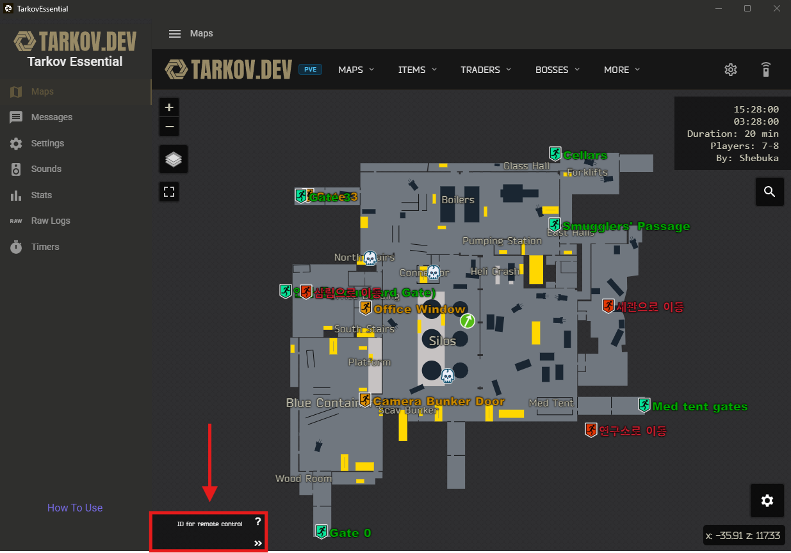
1. 왼쪽 하단에있는 Remote ID를 클릭해 복사합니다.

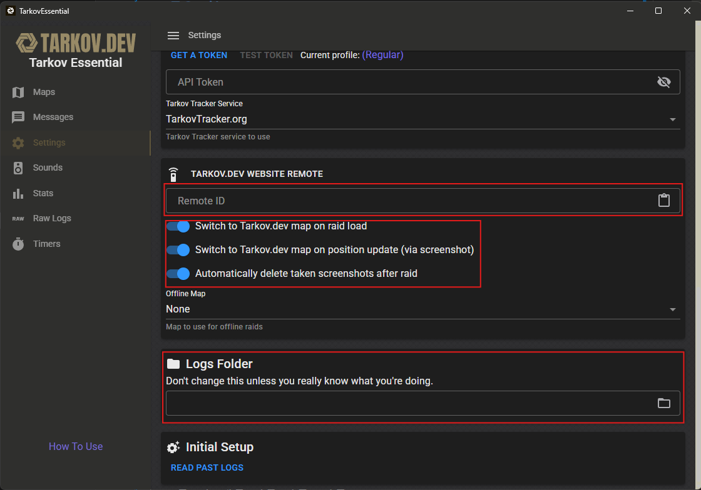
2. Setting 에서 복사한 Remote ID를 붙혀넣은 후 아래 토글 3개를 활성화 해줍니다.
 
3. 그 후, 타르코프 Logs 폴더 경로도 입력해줍니다.

- 스팀버전 : C:\Program Files (x86)\Steam\steamapps\common\Escape from Tarkov\build\Logs
- 공홈버전 : %LOCALAPPDATA%\Battlestate Games\Escape from Tarkov\Logs

## 사용 방법
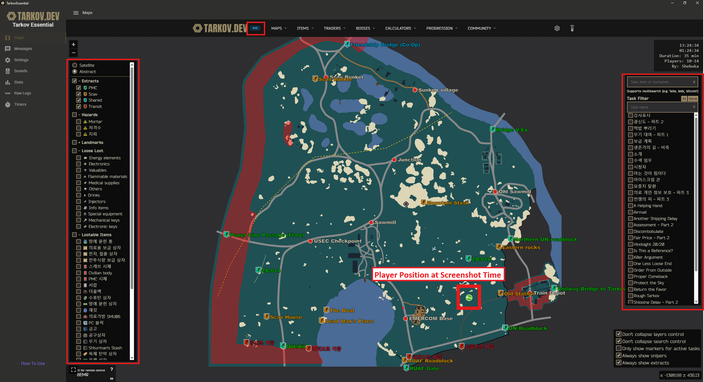

- 타르코프 스크린샷 키를 누르면 Maps 에서 플레이어의  위치가 표시됩니다.
- PVP 글씨를 누르면 PVE와 프로필 전환을 할 수 있습니다
- 주요 오브젝트 표시 및 퀘스트 표시가 가능합니다.
- Ctrl + 마우스 휠 을 이용해 층 이동이 가능합니다.

## 업데이트 확인

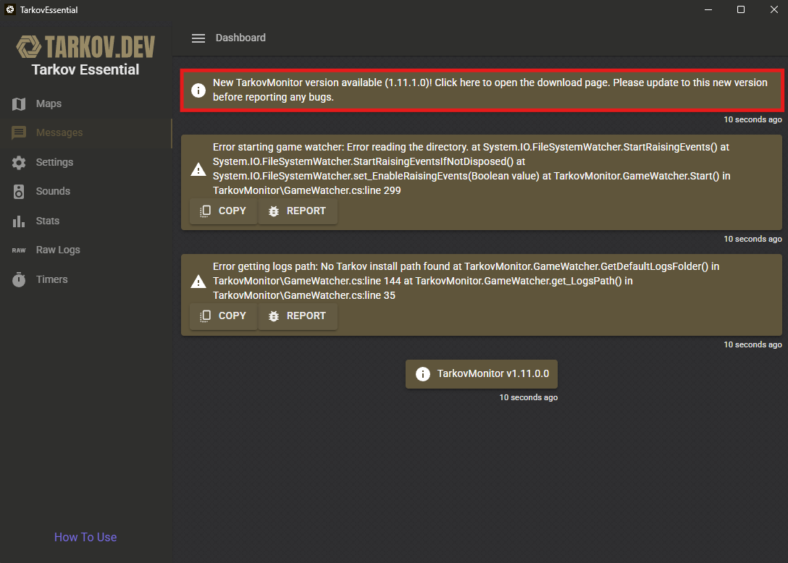

Tarkov Essential은 Tarkov Monitor의 업데이트에 맞춰 업데이트를 진행할 수 있습니다.

만약 프로그램이 예상대로 동작하지 않는다면 Messages 탭에서 업데이트 메시지를 클릭하여 업데이트를 진행해주세요.

## 타르코프 트래커 사용법
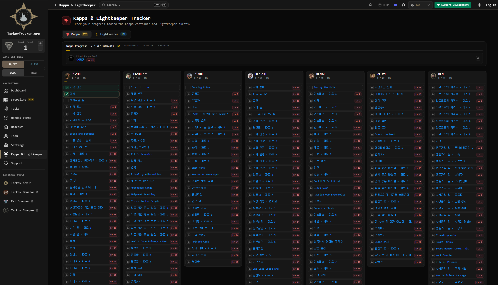
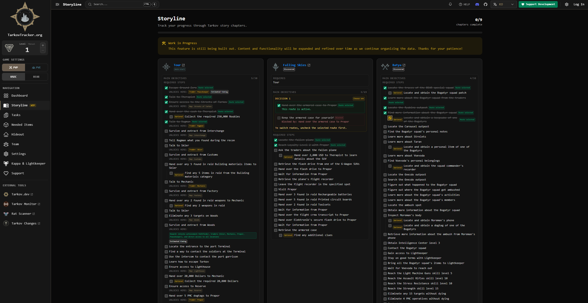
Tarker 탭을 통해 Tarkov Tracker를 사용할 수 있습니다.
Tarkov Tracker 는 퀘스트 정보나 완료시 다음 퀘스트, 카파퀘스트 등이 정리되어 있으며 수동으로 체크하면서 퀘스트를 트래킹 할 수 있습니다.

그 외에도 메인 스토리 체크나 하이드아웃 재료 체크등 다양한 기능이 존재합니다.

### 타르코프 트래커 연동방법
Tarkov Tracker를 Tarkov Essential과 연동할 경우 Maps에 현재 진행중인 퀘스트만 표시해주며, 퀘스트 클리어시 자동으로 Tarkov Tracker에 완료 처리가 됩니다.

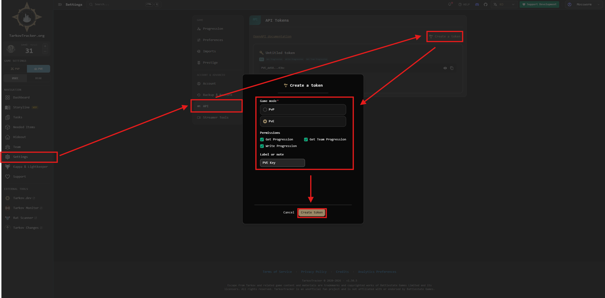
1. Tarkov Tracker 회원가입 후 Setting에서 API키를 발급받아줍니다.

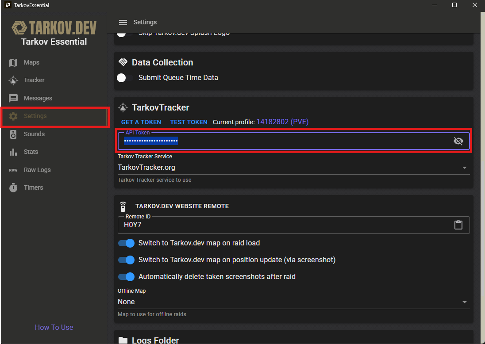
2. Tarkov Essential에서 발급받은 API키를 입력해줍니다.

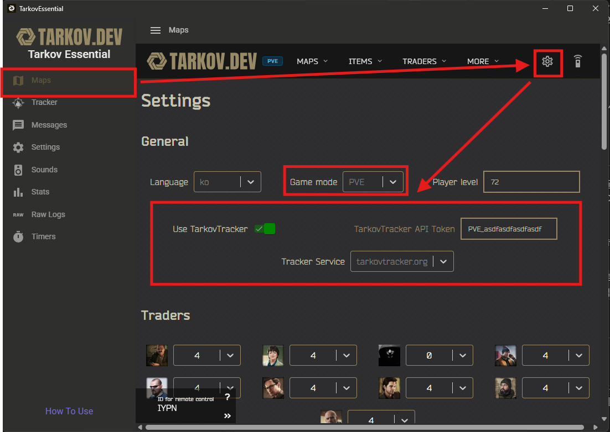
3. Maps에서 Settings에 들어가 마찬가지로 발급받은 API키를 입력후 Use TarkovTracker를 활성화 해줍니다.

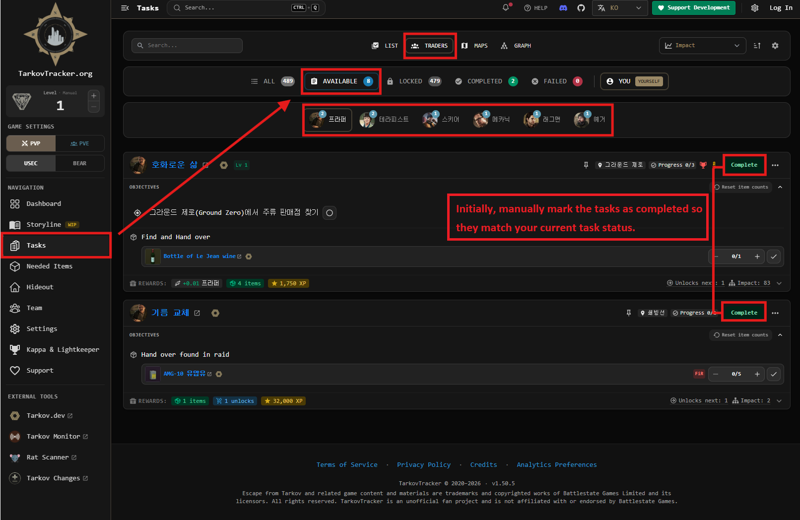
4. 진행도를 맞추기위해 Tasks에서 이미 완료한 퀘스트를 수동으로 완료처리를 해줍니다. (한번만 해주면 그 다음부터는 Tarkov Essential이 알아서 완료처리를 해줍니다.)

### 연동 결과
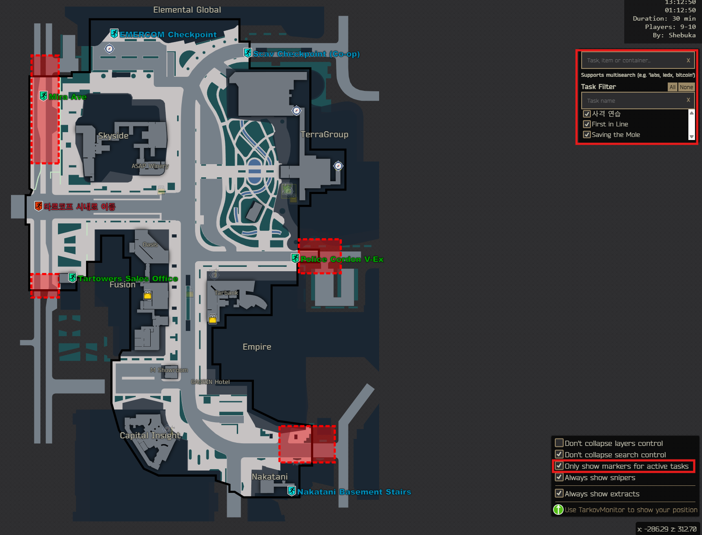
연동후 Only show markers for active tasks를 활성화 하면 현재 진행중인 퀘스트만 Maps에 표시됩니다.

## 문제 해결
- 앱이 실행되지 않고 "잘못된 WebView2 설치" 오류(때때로 "지정된 파일을 찾을 수 없습니다"라는 오류와 함께 표시됨)가 나타나는 경우, 알려진 WebView2 문제에 직면했을 가능성이 높습니다. 
  - [프로그램 실행 오류(WebView2 설치 오류) #22 — 해결 방법 설명](https://github.com/the-hideout/TarkovMonitor/issues/22#issuecomment-3443766675)

- 웹뷰를 설치하는 코드가 바이러스로 오인검사되어 다운로드가 실패될 수 있습니다. 그럴경우 윈도우 디펜더에서 실시간 보호를 잠시 끄고 받아주신후 다시 켜주세요. 

> [!WARNING]
> 위 문제들은 제 코드 문제가 아닌 타르코프 모니터의 코드구조를 따르기에 어쩔 수 없이 발생할 수 있습니다.
> 최대한 원본 코드를 건드리지 않는게 목표이므로 양해 부탁드립니다.

## FAQ

### 작동원리가 어떻게 되나, 치트 아닌가?
해당 프로그램은 tarkov.dev에서 제작한 TarkovMonitor를 기반으로 제작되었으며 타르코프는 게임중 주기적으로 txt 형태의 로그파일이 생성되고 이 로그파일안에 적힌 정보를 읽어서 맵에 플레이어 위치를 마커로 찍어주는 방식으로 작동됩니다. 자세한 답변은 [TarkovMonitorFAQ](https://github.com/the-hideout/TarkovMonitor#faq)서 확인할 수 있습니다.

### Where am i 랑 뭐가 다른가?
작동원리나 사용성은 거의 비슷합니다. 차이점은 where am i는 tarkov market 사이트를 기반으로 tarkov essential은 tarkov.dev 를 기반으로 만들어졌습니다.

tarkov market은 빠른 업데이트와 다양한 편의 기능이 장점이지만 일부 기능은 멤버십이 필요합니다. tarkov.dev는 오픈소스 기반으로 대부분의 기능을 무료로 사용할 수 있고 외부 서비스 연동이 쉬운 대신, 세부 기능과 업데이트 측면에서는 tarkov market보다 다소 단순한 편입니다.

### 해당 프로젝트를 수정해서 배포하거나 사용해도 되나?
가능합니다. 단, 원본 프로젝트인 TarkovMonitor는 GPL-3.0 라이선스이므로 배포 시 소스코드를 함께 공개해야 합니다.